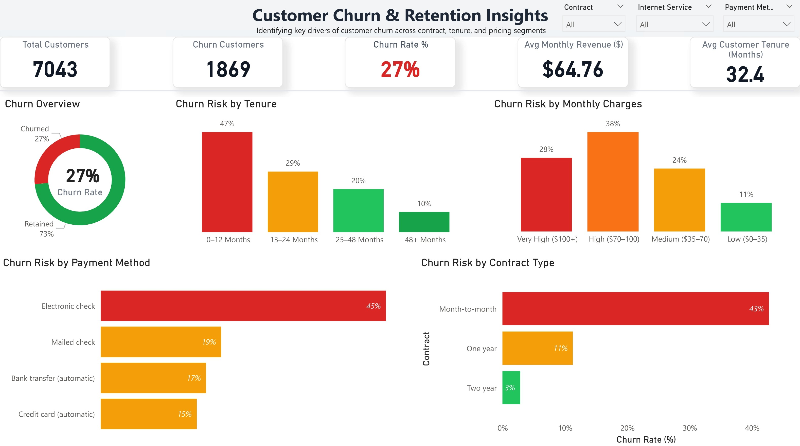

# 📊 Customer Churn Analysis | SQL + Python + Excel + Power BI

## 📌 Project Overview

This project analyzes customer churn behavior in a telecom business to identify key drivers of customer attrition and provide actionable insights for improving customer retention.

The project is built using SQL, Python, Excel, and Power BI, covering the complete data analytics lifecycle from data preparation to business insights.

---

## 🎯 Objectives

* Identify high-risk customer segments
* Understand churn patterns across tenure, contract type, and pricing
* Analyze behavioral and operational drivers of churn
* Provide data-driven recommendations to reduce churn

---

## 🧱 Project Workflow

```plaintext
Raw Dataset → Excel Analysis → SQL Transformation → Python EDA → Power BI Dashboard
```

---

## 📊 Excel Analysis (Initial Business Understanding)

* Built pivot tables to analyze churn distribution
* Created KPI dashboard for quick insights
* Identified early patterns in customer behavior

📄 File: `excel/telco_churn_dashboard.xlsx`

---

## 🗄️ SQL (Data Cleaning & Transformation)

* Created staging and final structured tables
* Converted raw fields into proper data types (boolean, numeric, etc.)
* Performed churn-focused analysis queries

📄 SQL File: `sql/Telco_SQL.sql`

### Key SQL Analysis:

* Overall churn rate and customer summary
* Churn by contract type, tenure, and payment method
* Revenue at risk due to churn
* Cohort analysis (tenure × contract)

---

## 🐍 Python (Exploratory Data Analysis)

Performed detailed EDA using Python:

* Data cleaning and preprocessing
* Churn distribution analysis
* Correlation and feature exploration
* Visualization using Matplotlib and Seaborn

📄 Notebook: `python/telco_eda.ipynb`

---

## 📊 Power BI Dashboard (Final Output)

Developed an interactive dashboard to visualize churn insights:

### Key Features:

* KPI cards (Total Customers, Churn Rate, Revenue at Risk)
* Churn by Contract Type
* Churn by Tenure
* Churn by Monthly Charges
* Churn by Payment Method
* Interactive slicers for segmentation

📸 Dashboard Preview:


---

## 📈 Key Insights

* Customers with **month-to-month contracts** have the highest churn (~43%)
* Customers in their **first year (0–12 months)** show highest churn (~47%)
* **Electronic check users** have significantly higher churn (~45%)
* Higher monthly charges are associated with increased churn risk

---

## 💡 Business Recommendations

* Encourage customers to shift to **long-term contracts**
* Improve onboarding experience for new customers
* Promote **automatic payment methods**
* Offer targeted retention strategies for high-risk segments

---

## 🛠️ Tools & Technologies

* Excel (Pivot Tables, KPI Dashboard)
* SQL (PostgreSQL)
* Python (Pandas, Matplotlib, Seaborn)
* Power BI (Interactive Dashboard)
* Data Modeling & Visualization

---

## 📂 Dataset

Telco Customer Churn Dataset (public dataset)

---

## 🚀 How to Use

1. Explore Excel dashboard for quick insights
2. Run SQL scripts for data transformation and analysis
3. Use Python notebook for deeper exploration
4. Open Power BI dashboard for interactive insights

---

## 👤 Author

Bhushan Tandale
